# Mail Client - Exercise 4

you can find our repository in the link: https://github.com/AlmogMeirov/Mail.git

**This part implements a complete Gmail-like mail client system with a React frontend (Exercise 4), building upon the Node.js web server from Exercise 3 and the C++ blacklist server from Exercise 2.**
> 📱 **Looking for the Android mobile version?** Switch to the [`exercise-5`](https://github.com/AlmogMeirov/Mail/tree/exercise-5) branch.
> 
## Purpose

In this part of the project, we developed a comprehensive *mail client system* that featuring a *modern React frontend* with Gmail-like interface. The server interacts with the Node.js *mail server* from exercise 3 to handle the server side and the C++ *blacklist server* from exercise 2 to verify links within mail content using a *TCP socket*.

The system supports:

* User registration and login with JWT authentication
* Sending and receiving mails
* A modern React frontend with Gmail-like interface
* Advanced label management system with custom user labels
* Dark mode theme support with complete UI adaptation
* Enhanced spam detection with automatic URL blacklisting
* Draft saving and editing capabilities
* Multi-recipient support (To, CC, BCC)
* Real-time search and filtering
* Integration with the blacklist server (via TCP) to block mails with blacklisted URLs

The system integrates three main components:

* React Frontend - Modern Gmail-style user interface
* Node.js Backend - RESTful API with JWT authentication and label management
* C++ Blacklist Server - High-performance TCP server for URL validation

## Build and Run Instructions

### Prerequisites:

* Docker
* Docker Compose
* Web browser


### Step 1: Build & Start the Services
#### Open terminal:

  In the root project directory (*Mail* folder), run:

 ```
  docker-compose up --build -d
 ```

  This will build and start three services:

* **client:** React frontend on port 3001
* **mail-server**: A Node.js web server on port 3000
* **blacklist-server:** A C++ TCP server on port 5555, connected to a persistent urls.txt file for blacklist storage

---

### Step 2: Access the Application:
  Open your web browser and navigate to:

  ```
  http://localhost:3001
  ```
  
  
### Step 3: Registration & Authentication
If you wish to log in with 2 different users, you must open **different browsers** (e.g., Chrome, Firefox) to simulate multiple users simultaneously, as mentioned in the PDF task file.

**Development Data Storage**  
As designed for this exercise, all data is stored **in-memory only** (no database required). Restarting mail-server will **reset all data** - perfect for testing and development. The frontend container can be restarted safely.

## Application Usage Guide
  ###  Getting Started
  When opening http://localhost:3001, you will be directed automatically to the *login* screen, as shown below. You probabely don't have a user yet if you just built and ran the project, so click on **Register here** for signing up:
  
  **Login Screen**   
   
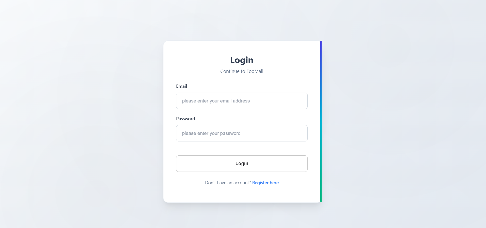 

  **Registration**

Create a new account with email, password, and personal details. Mandatoty fields are marked with a star (*).

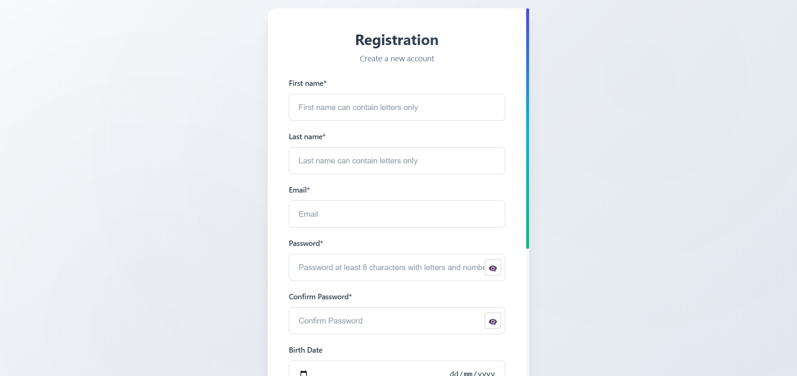

> **Registration Tip:** If registration fails due to server issues (e.g., email already exists, image file too large), error messages appear at the top of the registration form. **Scroll up** to view the error details.

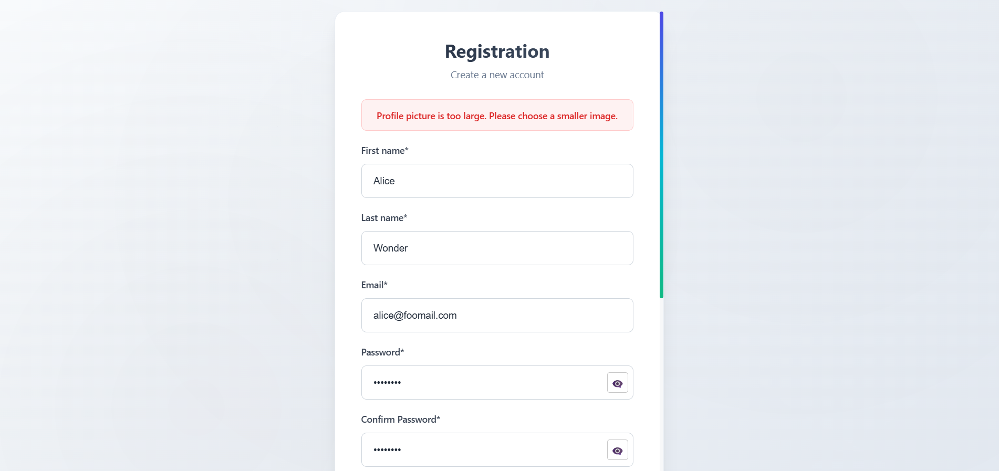

  **Signing In**

After a successfull registration, toy will be directed to the login screen again. This time'you have an account in FooMail, so you can log in with your email address and password.

You're all set! **Welcome to FooMail!**

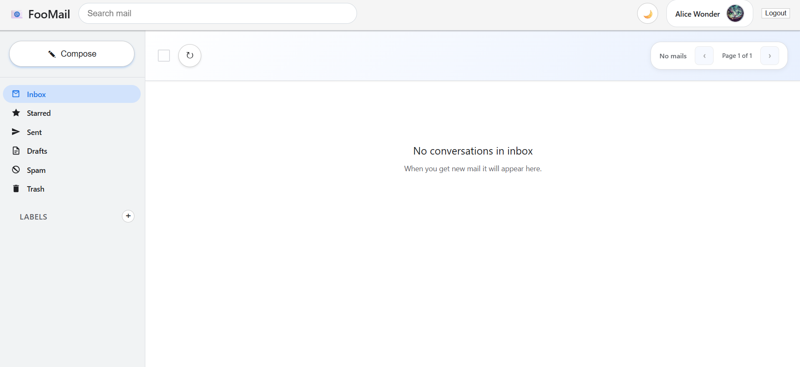


  ### Email Operations
  **Composing Emails**
1. Click the "Compose" button in the sidebar
2. Fill in recipients (To, CC, BCC), subject, and content
3. Send immediately or Save as Draft for later
   
   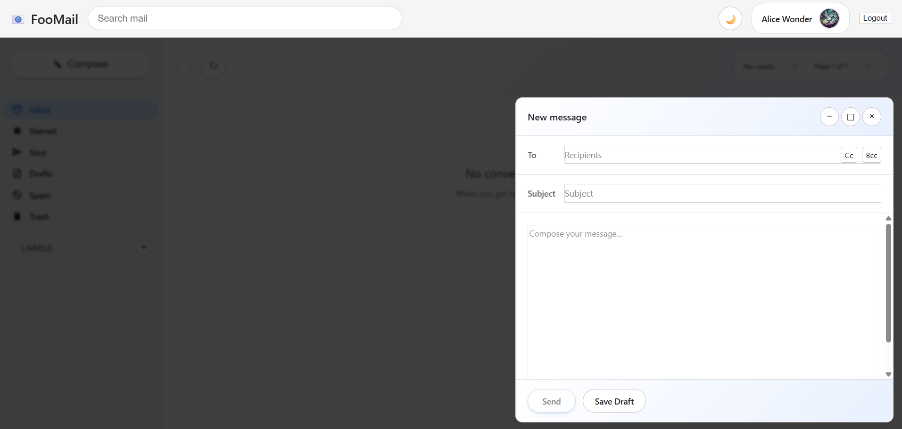
   > **Note:** Sending an email or saving as a draft will close the composing box, but you can also close the composing box by clicking the x button on the top right, or by clicking anywhere in the darked area outside the box.
5. Once the email is sent, you can see it in the *sent* label.
   
   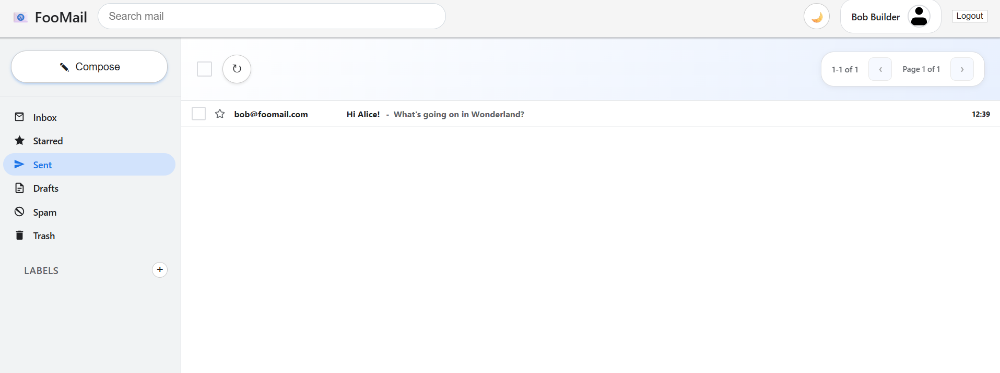
7. The recipient can see the mail in their *inbox*.
   
   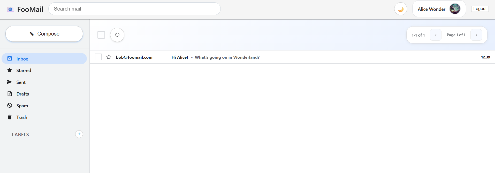
9. By clicking on it, from either *sent label* or *inbox label*, you can read the full email, reply or send it forward.
    
   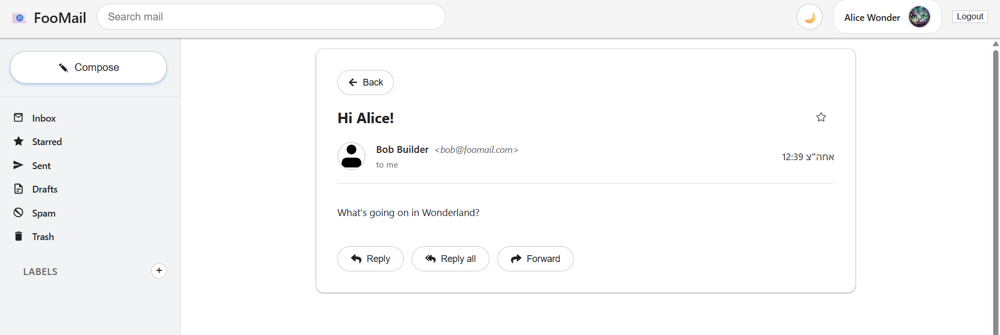
##
   **Managing Labels**
1. **Create Labels:**
   - Use the "+" button in the Labels section
   - Type the new label name in the small text box
     
     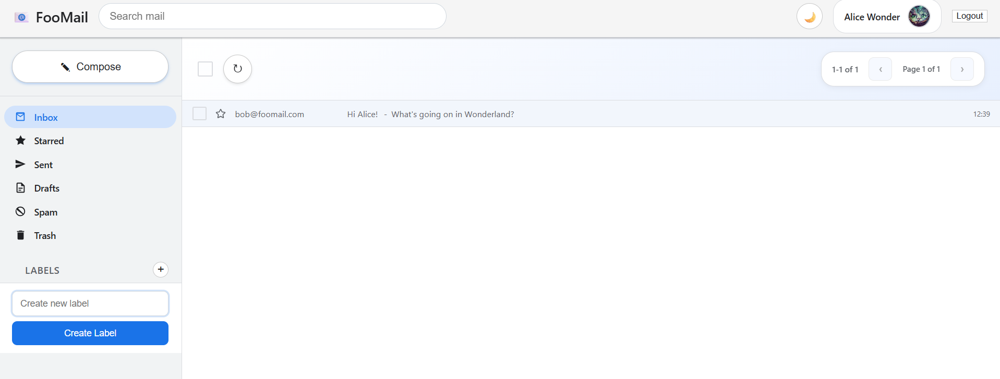
   - When your'e done, click on the *Create Label* button or press *Enter*
   - As long as the new label name is valid, the new label is shown now on the sidebar!
   - If the new label name is invaild, the label will not be created   
2. **Edit Labels:**
   - Hover with your mouse on the label in the sidebar
   - Click on the three dots button that appears nest to the label's name
     
     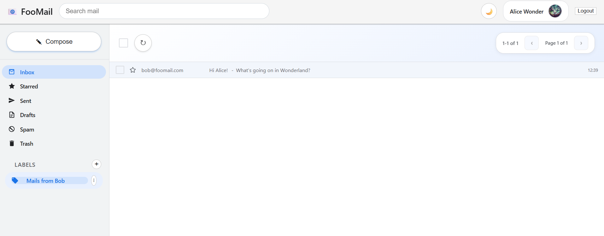
   - In the small menu that was just opened, choose weather you wnat to rename the label, or delete it.
   - As long as the new label name is valid, the new label name is shown now on the sidebar!
   - If the new label name is invaild, the label will not be renamed.  
3. **Apply Labels:**
   - Click the circled arrow button below the top bar to sync the inbox
   - Hover with your mouse on the mail you want to tag

     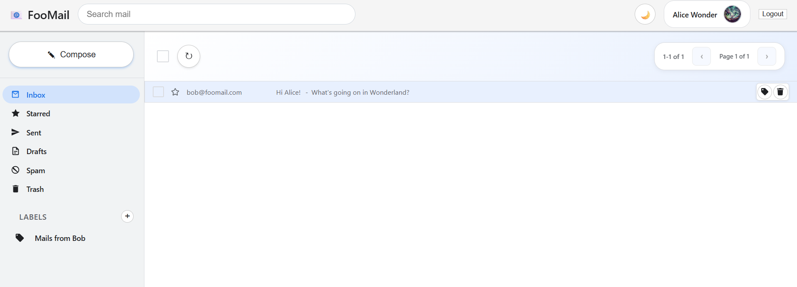
   - Click on the left button to open the labels list
  
      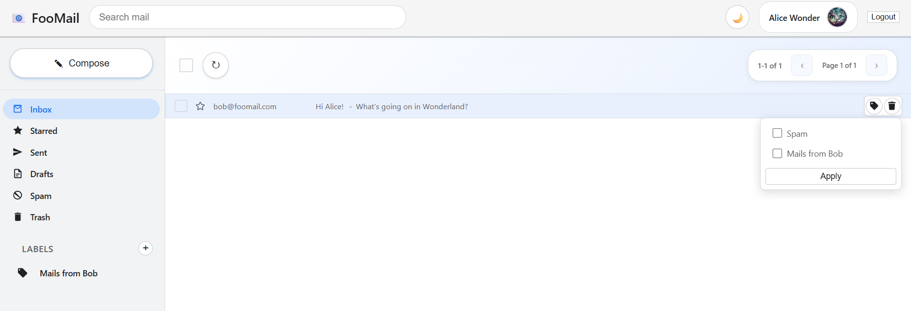
   - Click on the chosen label. You can choose as many labels as you want.
     > **Note:** You can tag your selected email as *Spam*. In this case, every URL address in the title and the content of this specific email will be added to the blacklist. from now on, any new email that contains these blacklisted URLs will be delivered directly to *Spam*.
     > **Note:** The starred feature works like Gmail - clicking the star icon toggles the "Starred" label on emails. This creates a quick way to organize high-priority messages.
5. **Filter by Label:**
   - Click on label names in the sidebar
   - You will see all the mails from this label and from this label only.
   - 
       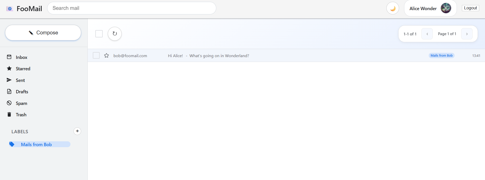
##
  **Drafts**
1. **Create a draft:**
   - Open the composing box by either clicking on the "Compose" button in the sidebar, or the *Reply* or *Forward* buttons inside a specific mail.
   - Fill in recipients (To, CC, BCC), and click on *Save Draft*.
   
   
3. **Edit Draft:**
   - Click on the *Drafts* label on the sidebar. You'll be directed to the drafts page.
     
    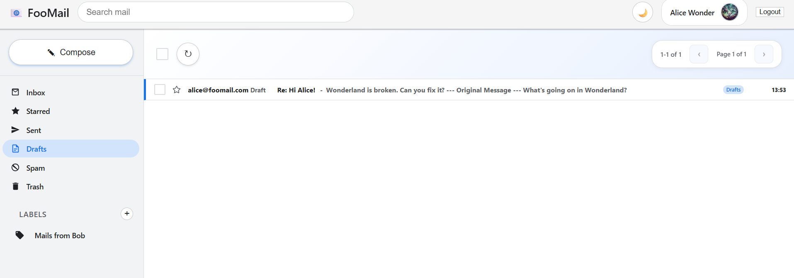
   - Click on the draft that you want to edit, and edit the chosen draft in the *draft editor*.

     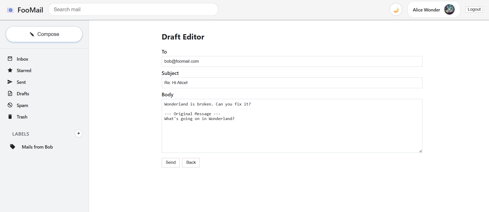
##
  **Delete Mails**
  1. Hover with your mouse on the mail you want to delete

     
  2. Click on the right button to move the mail to *Trash*
  3. The deleted mail is still available in the *Trash* label. Click on *Trash* on the sodebar to see the deleted mails

     
  4. To **permanently delete** emails, first move them to *Trash*, then hover over the email and click the x icon that appears.

     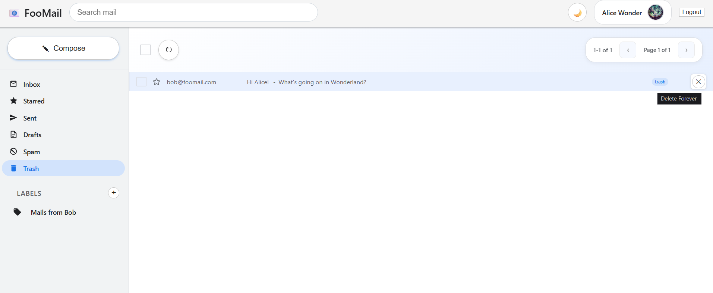
##
  **Search Mails By Query**
  1. Use the search bar in the top navigation
  2. Enter keywords to search across all email content
  3. Press *Enter* to seardh
  4. The search results will be shown below.

     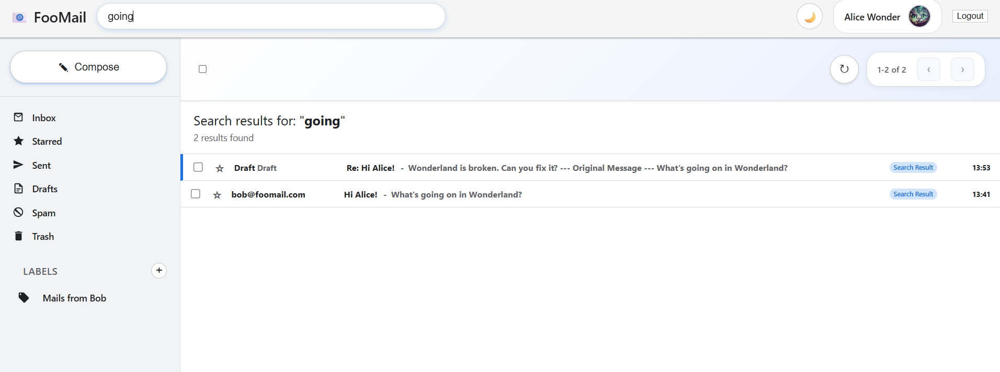
##
  **Theme Customization - Dark And Light Mode**
  * Wherever you are on *Foomail*, click the 🌙/☀️ icon in the top bar to switch themes

    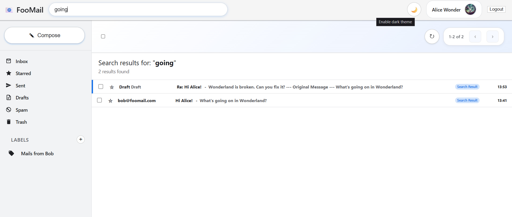

    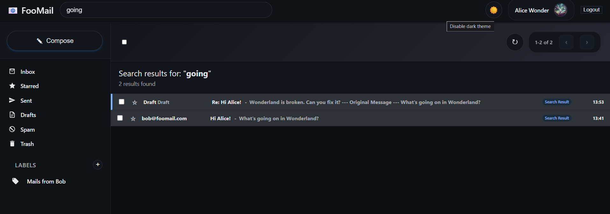
  * Your preference is automatically saved and persists across sessions
  * All interface elements adapt to the selected theme

    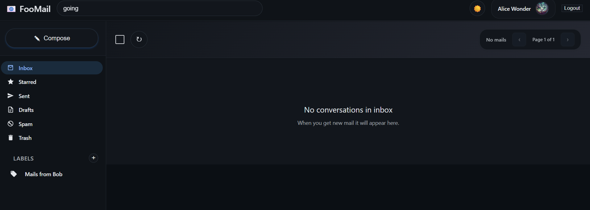

    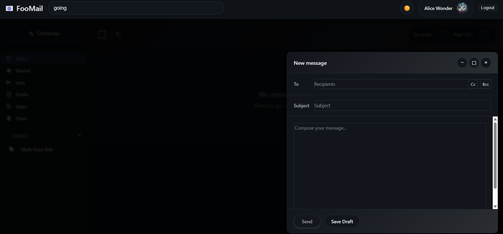

    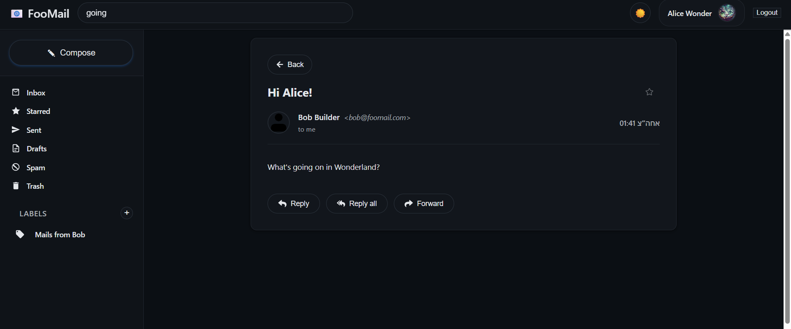

    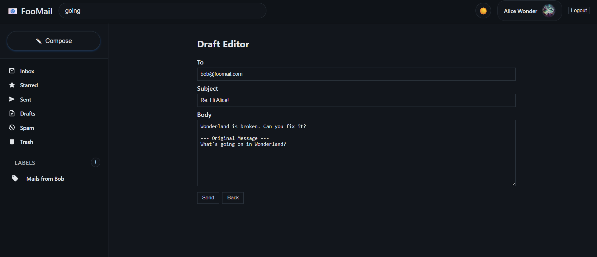
  * Only registered users can switch between themes, but if you log out when dark mode is activated - the registration screen ang login screen will be darked as well.

    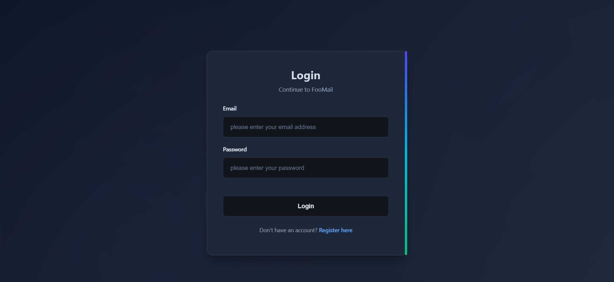

    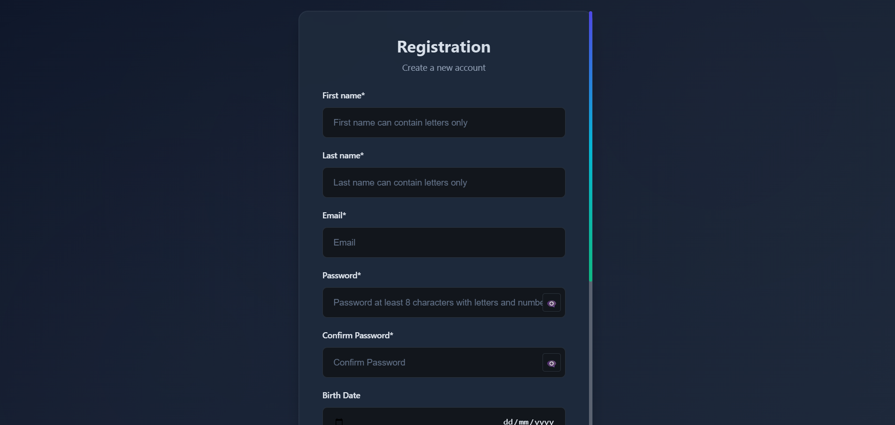
    

##  Implementation Notes
### Advanced Label System
* **System Labels:** Automatically created (Inbox, Sent, Drafts, etc.)
* **Custom Labels:** User-created with full CRUD operations
* **Multi-label Support:** Emails can have multiple labels simultaneously
* **Label Inheritance:** Proper handling of system vs user labels
* **Bulk Operations:** Apply/remove labels from multiple emails

### Dark Mode Implementation

* **CSS Variables:** Centralized theming system
* **Theme Persistence:** User preferences saved in localStorage
* **Component Coverage:** All UI elements support both themes
* **Smooth Transitions:** Animated theme switching

## Enhanced Email Features

* **Draft System:** Auto-save and manual save for incomplete emails
* **Multi-recipient:** Full support for To & CC fields
* **Rich Compose:** Gmail-like compose window with all features
* **Advanced Search:** Search across all email fields

### Spam Protection Enhancement

* **Real-time Detection:** URLs checked during email sending
* **Automatic Labeling:** Spam emails automatically tagged
* **TCP Integration:** High-performance C++ server for URL validation
### Miscellaneous
* The C++ server uses a Bloom Filter to quickly check for URL membership
* All communication between the web client and the web server, as well as the web server and C++ blacklist, server happens over TCP
* Data is kept *in memory* in the web server (no database is used)

  ---


## Docker Notes

  * *Blacklist server* expects the file data/urls.txt to exist or will create it
  * Ports used:
    *Client: 3001
    * Node server: 3000 (internal communication only)
    * C++ server: 5555 (internal communication only)
  * Containers communicate using Docker’s internal network (via container name)

  To stop the services:

  ```bash
  docker-compose down
  ```


##  Project Structure

MAIL/
├── .vscode/                         → VSCode workspace settings

├── data/                            → Shared data (e.g., urls.txt used by the C++ server)

├── server/

│   └── controllers/

│       └── mailController.js        → Legacy controller (can be migrated under src/)

client/

├── public/                     # Static assets

├── src/

│   ├── components/            # Reusable UI components

│   │   ├── Layout.jsx         # Main app layout

│   │   ├── Sidebar.jsx        # Navigation sidebar

│   │   ├── Topbar.jsx         # Header with search

│   │   ├── SendMailComponent.jsx  # Compose box

│   │   └── ThemeToggle.jsx    # Dark mode toggle

│   ├── pages/                 # Page components

│   │   ├── Login.jsx          # Authentication

│   │   ├── Register.jsx       # User registration

│   │   ├── LabelPage.jsx      # Email list view

│   │   ├── MailViewPage.jsx   # Individual email view

│   │   └── SearchResultsPage.jsx  # Search results

│   ├── context/               # React Context providers

│   │   ├── SearchContext.js   # Global search state

│   │   └── SendMailContext.jsx  # Compose modal state

│   ├── theme/                 # Theme system

│   │   └── ThemeProvider.jsx  # Dark mode provider

│   ├── styles/                # CSS styling

│   │   ├── theme.css          # CSS variables for theming

│   │   ├── Login.css          # Authentication styles

│   │   └── MailViewPage.css   # Email view styles

│   └── utils/                 # Utility functions

│       ├── api.js             # API communication

│       └── waitForServer.js   # Server readiness check

├── src/

│   ├── cpp_server/                  → C++ TCP blacklist server

│   │   ├── BloomFilter.cpp/.h       → Bloom filter implementation

│   │   ├── Hash*.h                  → Hash function variants

│   │   ├── InfiniteCommandLoop.cpp  → Main server loop

│   │   ├── URL*.cpp/.h              → URL checker, storage, and utility logic

│   │   ├── tcp_client.py            → Python client for testing

│   │   ├── CMakeLists.txt           → Build configuration for C++ components

│   │   └── dockerfile               → Docker config for C++ server

│   └── node_server/                → Node.js web server

│       ├── controllers/            → Logic for routes (e.g., auth, mails)

│       ├── middlewares/           → Token authentication (JWT)

│       ├── models/                 → In-memory storage for users and mails

│       ├── routes/                 → Express route definitions

│       ├── uploads/                → Uploaded user profile images

│       ├── utils/                  → Utility functions (e.g., crypto)

│       ├── app.js                  → Express app setup

│       ├── curl/                   → CURL test scripts (optional)

│       ├── dockerfile              → Docker config for Node.js server

│       ├── index.js                → Main entry point (runs the server)

│       ├── package.json            → Project metadata and dependencies

│       └── package-lock.json

├── docker-compose.yml             → Compose file to orchestrate both services

├── dockerfile                     → (Possibly legacy) Dockerfile

├── CMakeLists.txt                 → Top-level CMake (links into src/cpp_server)

├── package.json                   → (Legacy or root Node metadata)

├── package-lock.json

└── README.md                      → Project documentation


## Team

  * Almog Meirov
  * Tomer Grady
  * Meir Crown


## Technologies Used
  * *React 19.1.0* 
  * *React Router 7.6.2*
  * *React Icons 5.5.0*
  * *CSS Variables*
  * *Node.js + Express*
  * *C++17 (multi-threaded)*
  * *Docker + Docker Compose*
  * *JWT Authentication*
  * *Bloom Filter* for blacklist
  * *TCP Socket Communication*

## FooMail - Advanced Mail Client System
*A modern, feature-rich email client with React frontend*
Version: 4.0

# Enjoy!!
