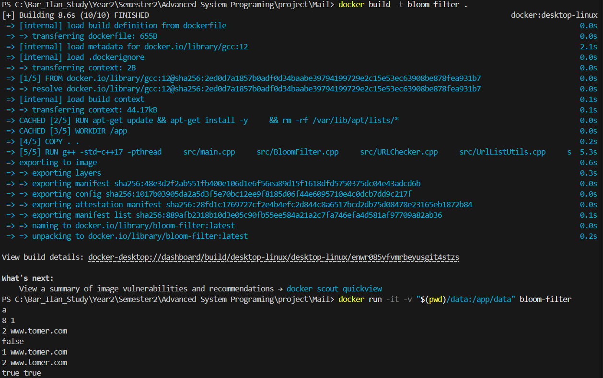

# Mail

## Project 

In this part of the project, we developed a client-server system for managing URL data using a Bloom Filter. The code was structured with a modular design and adherence to SOLID principles, especially the Open/Closed Principle. We containerized the system with Docker, ensuring clean separation between services. Connection handling, error responses, and client-server communication were thoroughly tested and refined.

---

## Project Structure

```
/src        - Source files (C++ .cpp and .h)
/tests      - Test files (currently not used)
/data       - Data files (e.g., urls.txt)
/Dockerfile - Docker setup
/README.md  - Project documentation
```

---

## Build and Run Instructions

### Build the Docker image

```bash
docker-compose build --no-cache
```
### Start the Server

```bash
docker-compose up -d server
```

### Run the Client

```bash
docker-compose run --rm client
```

> **Important:**  
 - client will automatically try to connect to the server container using the internal Docker network.

- On first connection, the server will prompt for Bloom Filter configuration (e.g. 1024 2 1).

- Input must follow the format: COMMAND URL (e.g. POST www.google.com).

- Invalid commands or malformed URLs will result in a 400 Bad Request response.

---

## Expected Input

1. **Initial Configuration**:  
   Enter a line specifying:
   
   ```
   <bit array size> <number of iterations of first hash function> [optional: number of iterations of second hash function]
   ```
   
   Example:
   ```
   256 2 1
   ```

2. **URL Commands**:  
   After configuration, you can add or query URLs interactively:
   <br>
   Adding URL:
    ```
   1 <URL>
     ```
   Checking if URL is in list:
    ```
   2 <URL>
    ```
    Only valid URLs can be added.
---

## Example Run

  ```
   a
   8 1
   2 www.tomer.com
   false
   1 www.tomer.com
   2 www.tomer.com
   true true
   1 ww.meir.com
   2 ww.meir.com
   2 www.meir.com
   false
  ```
Below is an example of program execution:

---

## Notes

- Data files are located under the `/data` directory.
- The application expects to find (or create) `urls.txt` at `../data/urls.txt` relative to the executable's runtime location.
- If the file does not exist, it will be created automatically.

---

## Authors

- Developed by Almog Meirov, Tomer Grady, Meir Crown

---

## Technologies Used

- **C++17**
- **Docker**
- **Bloom Filter Data Structure**
- **Regex-based URL validation**

---

# Enjoy!
